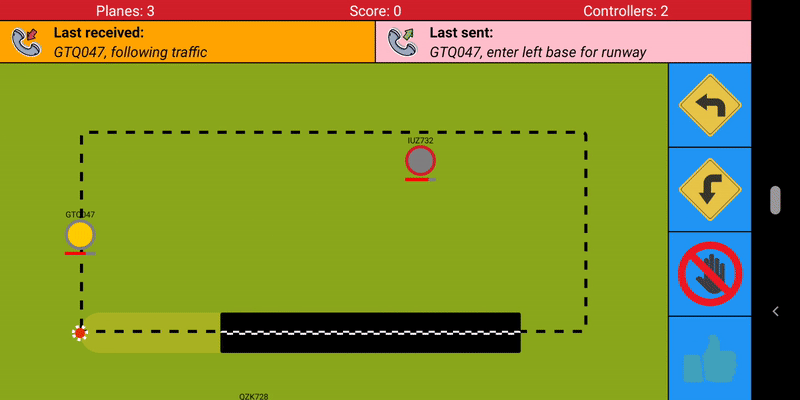
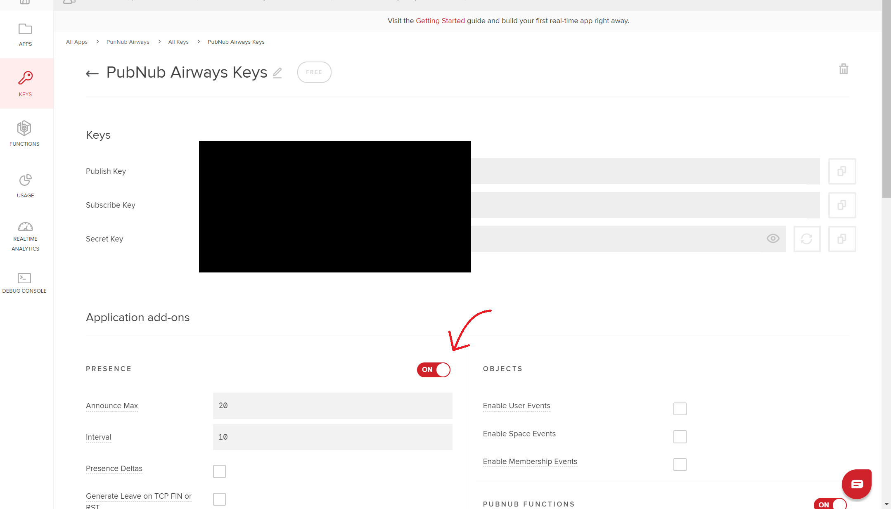

# PubNub Airport

A project that demos PubNub and JavaScript technologies through an air traffic control game.

This repository contains two separate applications which both need to be run in order to play the game. Execution instructions are provided below.

This project comes with a three part blog series which can be accessed below. For additional support or guidance, please refer to these blogs:
* Part 1: [https://www.pubnub.com/blog/create-a-node-application-with-pubnub-atc-game-part1](https://www.pubnub.com/blog/create-a-node-application-with-pubnub-atc-game-part1)
* Part 2: [https://www.pubnub.com/blog/create-a-react-native-app-with-pubnub-atc-game-part2](https://www.pubnub.com/blog/create-a-react-native-app-with-pubnub-atc-game-part2)
* Part 3: [https://www.pubnub.com/blog/using-typescript-and-pubnub-presence-atc-game-part3](https://www.pubnub.com/blog/using-typescript-and-pubnub-presence-atc-game-part3)

*Note: For parts 1 and 2 please refer to the JavaScript version of this project: [https://github.com/lukehuk/pubnub-airport](https://github.com/lukehuk/pubnub-airport)*

# Airfield
The server-side component of the game that represents an airfield.

## Getting Started
### Prerequisites
This project requires:
* Node.js (with NPM)

### Installing
In order to use the application you will need publisher and subscriber PubNub keys. Free registration is possible at [https://dashboard.pubnub.com/signup](https://dashboard.pubnub.com/signup) 

The API keys should be added as the `PUBLISH_KEY` and `SUBSCRIBE_KEY` constants in `airfield.js`.

You will also need to ensure that dependent modules are installed. You can do this by running `npm install` in the airfield directory.

Execution behaviour, such as plane generation frequency, can be modified by adjusting constants within the project files.

### Running
The application can be started by running `node --experimental-modules airfield.js` in the airfield directory.

*Note: The application is written using ES6 modules. At the time of writing the latest version of Node.js requires the "--experimental-modules" flag to be present. It is possible that in subsequent versions of Node this flag is no longer required.* 

# ATC
The client-side component of the game that represents an airfield.

## Getting Started

### Installing
In order to use the application you will need publisher and subscriber PubNub keys. Free registration is possible at [https://dashboard.pubnub.com/signup](https://dashboard.pubnub.com/signup?devrel_gh=luke)

The API keys should be added as the `PUBLISH_KEY` and `SUBSCRIBE_KEY` constants in `App.jsx`.

In order for Presence to work, you need to enable it from the PubNub dashboard. Simply log in, navigate to your API keys and enable the Presence add-on as shown in the screenshot below:

### Compiling
If your IDE does not support Typescript then you can manually execute the Typescript compiler by running `tsc` in the atc directory.

This will inform you of any compilation issues prior to runtime.

### Running
The application can be started by running `expo start` in the atc directory. With a smart device, scan the the QR code produced in the console with the Expo app.

There are several different ways to run Expo e.g. web, emulators, real devices. For information on these different deployment methods take a look at [https://docs.expo.io/versions/latest](https://docs.expo.io/versions/latest)

## Built With
* [PubNub](https://www.pubnub.com/) - Realtime messaging platform 
* [Node.js](https://nodejs.org/) - A JavaScript runtime
* [React](https://reactjs.org/) - A JavaScript library for building user interfaces
* [React Native](https://facebook.github.io/react-native) - JavaScript library for building user interfaces 
* [Redux](https://redux.js.org/introduction/getting-started) - A predictable state container for JavaScript apps
* [Expo](https://expo.io) - React Native deployment tools
* [Typescript](https://www.typescriptlang.org/) - A typed superset of JavaScript that compiles to plain JavaScript

## License
This project is licensed under the Apache-2.0 License